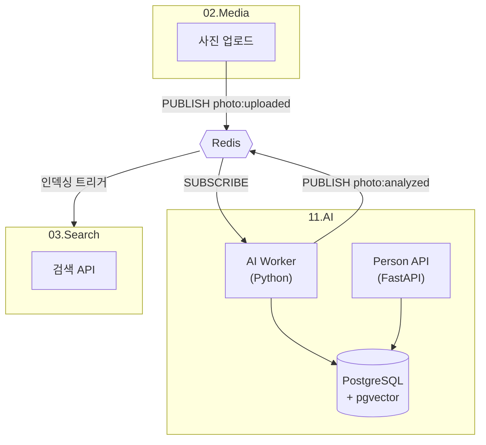

# 11. AI Service - 개발 명세서

> **범용 AI 처리 서비스 - 얼굴 인식, 메타데이터 추출, 인물 관리**

## 1. 개요

다른 서비스에서 AI 작업이 필요할 때 이벤트 큐 방식으로 처리하는 범용 AI 서비스입니다.

### 목표
- **얼굴 인식**: 감지, 임베딩, 유사도 매칭
- **메타데이터 추출**: EXIF 파싱, (추후) LLM 분석
- **인물 관리**: Person CRUD, 얼굴-인물 매핑

### MVP 범위
| 포함 ✅ | 추후 ⏳ |
|:---|:---|
| 얼굴 감지/임베딩 | LLM 이미지 분석 |
| EXIF 파싱 | 객체 인식 |
| 인물 CRUD | 텍스트 OCR |

---

## 2. 기술 스택

| 구분 | 기술 |
|:---|:---|
| **Worker** | Python 3.11 |
| **얼굴 인식** | face_recognition (dlib) |
| **EXIF** | Pillow |
| **Vector DB** | PostgreSQL + pgvector |
| **Event Bus** | Redis Pub/Sub |
| **API** | FastAPI |

### Redis 채널

| 채널 | Publisher | Subscriber | 용도 |
|:---|:---|:---|:---|
| `photo:uploaded` | 02.Media | 11.AI | 사진 분석 요청 |
| `photo:analyzed` | 11.AI | 03.Search | 분석 완료 알림 |
| `photo:reindex` | 11.AI(Person API) | 03.Search | 얼굴-인물 매핑 변경 후 재인덱싱 |

---

## 3. 아키텍처



---

## 4. 데이터베이스

```sql
-- 11.AI 전용 DB (ai-postgres)

CREATE EXTENSION IF NOT EXISTS vector;

-- 인물
CREATE TABLE persons (
    id UUID PRIMARY KEY,
    owner_id UUID NOT NULL,
    name VARCHAR(100) NOT NULL,
    relationship VARCHAR(50),
    created_at TIMESTAMPTZ DEFAULT NOW()
);

-- 얼굴 임베딩
CREATE TABLE face_embeddings (
    id UUID PRIMARY KEY,
    person_id UUID REFERENCES persons(id),
    media_id UUID NOT NULL,
    embedding vector(128) NOT NULL,
    bbox JSONB,
    created_at TIMESTAMPTZ DEFAULT NOW()
);

CREATE INDEX ON face_embeddings 
    USING ivfflat (embedding vector_cosine_ops);

-- 분석 결과
CREATE TABLE analysis_results (
    id UUID PRIMARY KEY,
    media_id UUID UNIQUE NOT NULL,
    status VARCHAR(20) DEFAULT 'PENDING',
    face_count INTEGER,
    taken_at TIMESTAMPTZ,
    latitude DOUBLE PRECISION,
    longitude DOUBLE PRECISION,
    analyzed_at TIMESTAMPTZ
);
```

---

## 5. API 엔드포인트

### Person API (FastAPI)

| Method | Path | 설명 |
|:---|:---|:---|
| `POST` | `/persons` | 인물 등록 |
| `GET` | `/persons` | 목록 조회 |
| `GET` | `/persons/:id` | 상세 조회 |
| `PUT` | `/persons/:id` | 수정 |
| `DELETE` | `/persons/:id` | 삭제 |
| `POST` | `/faces/:faceId/assign` | 얼굴에 인물 할당 |
| `GET` | `/faces/unassigned` | 미확인 얼굴 목록 |
| `GET` | `/analysis/:mediaId` | 분석 상태 조회 |

---

## 6. 프로젝트 구조

```
11.AI/
├── docker-compose.yml
├── docs/
│   └── DEV_SPECS.md
├── ai-worker/
│   ├── Dockerfile
│   ├── requirements.txt
│   └── src/
│       ├── main.py
│       ├── face_detector.py
│       ├── exif_parser.py
│       └── db.py
├── person-api/
│   ├── Dockerfile
│   ├── requirements.txt
│   └── src/
│       ├── main.py
│       ├── routes/
│       └── models/
└── sql/
    └── 001_init.sql
```

---

## 7. 개발 단계

### Phase 1: 기반 구축
- [ ] 프로젝트 구조 생성
- [ ] Docker Compose (PG + pgvector)
- [ ] Redis 연결

### Phase 2: AI Worker
- [ ] Redis SUBSCRIBE
- [ ] 얼굴 감지/임베딩
- [ ] EXIF 파싱
- [ ] pgvector 유사도 검색

### Phase 3: Person API
- [ ] FastAPI 프로젝트
- [ ] Person CRUD
- [ ] 얼굴-인물 매핑

### Phase 4: 연동 테스트
- [ ] 02.Media → 11.AI 이벤트 흐름
- [ ] 03.Search 인덱싱 트리거
